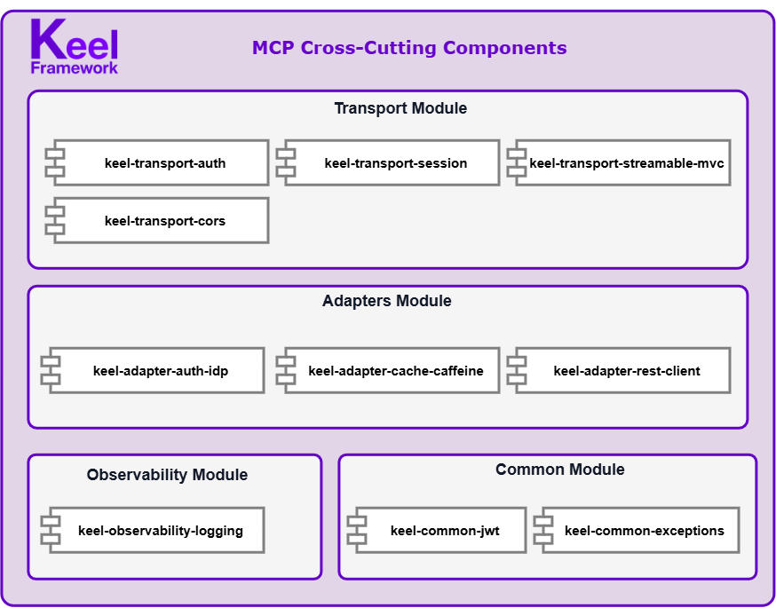
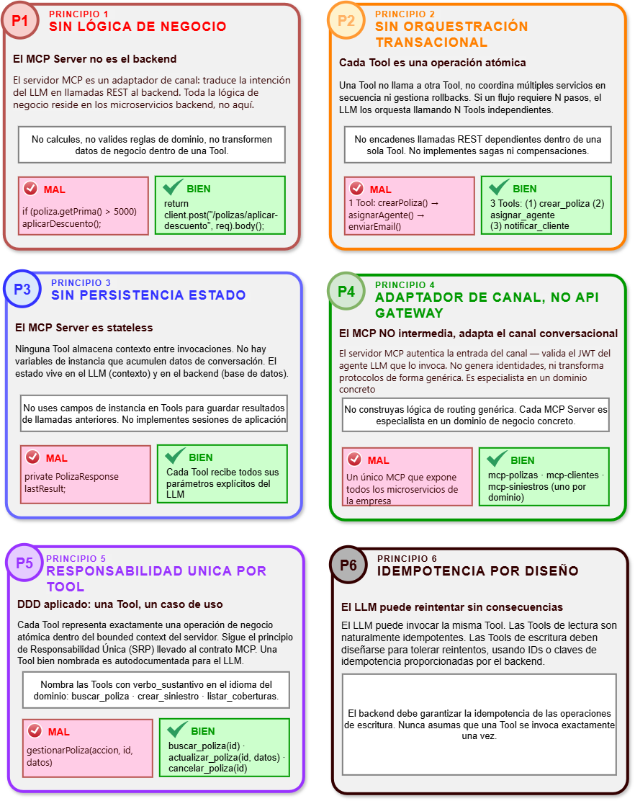
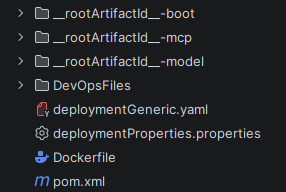

<h1>

</h1>

> **Reference Architecture & Maven Archetype for Building MCP Servers** · Java 25 · Spring Boot 4
---


---
## Introduction

⚓ **Keel-Framework/MCP** is the *keel* on which you build your MCP server (Model Context Protocol): a **modular, standardized, layered reference architecture**, designed to provide a common technical foundation for building MCP servers on top of **Spring AI**.

> [!IMPORTANT]
> **Keel is not a Spring AI wrapper, nor a simple project generator.**
>
> **Spring AI** provides the capabilities and abstractions needed to implement MCP, while **Keel** defines an **architecture, a set of reusable modules, and a set of technical conventions** for building MCP servers in a standardized way.

Keel encapsulates cross-cutting technical capabilities into **independent, composable modules**, so that each project doesn't have to implement and configure the same infrastructure solutions from scratch.

The **Maven Archetype** is part of Keel as a *scaffolding* mechanism, letting you generate new MCP Servers built on top of this architecture and its technical capabilities. This way, development can focus on the server's functional capabilities: **Tools, Resources, and Prompts**.

### 🧩 Capabilities provided

Among the capabilities Keel provides:

- **Authentication and security** — JWT validation against an OIDC identity provider
- **MCP session management** — `Mcp-Session-Id` lifecycle
- **Streamable HTTP transport** — communication endpoint with MCP hosts
- **CORS configuration** — for browser-based clients
- **Local cache** — based on Caffeine
- **HTTP service integration** — preconfigured REST client for Tools
- **Observability** — structured logs

🚀 **Get started:** use **"Use this template"** on GitHub or clone the repository to create your own **Keel-based MCP Server**.

---
## Table of Contents

- [ **Keel Architecture**](#keel-architecture)
  - [Overview](#overview)
  - [Keel in the Spring AI MCP ecosystem](#keel-in-the-spring-ai-mcp-ecosystem)
  - [Framework Modules](#framework-modules)
  - [Maven Structure of the Framework](#maven-structure-of-the-framework)
  - [Framework Requirements](#framework-requirements)
  - [Technology Stack](#technology-stack)

- [🧭 **Design and Development Principles**](#design-and-development-principles)
  - [Introduction](#introduction-1)
  - [Architectural Principles](#architectural-principles)

- [🚀 **Quickstart & Scaffolding**](#quickstart--scaffolding)
  - [Option A — Generate an MCP Server with the Installer JAR](#option-a--generate-an-mcp-server-with-the-installer-jar)
    - [(1-2) Get the Installer JAR](#1-2-get-the-installer-jar)
    - [(2-2) Generate the Scaffolding](#2-2-generate-the-scaffolding)

  - [Option B — Clone and adapt the Keel Framework](#option-b--clone-and-adapt-the-keel-framework)
    - [(1-2) Clone/Build the Framework](#1-2-clonebuild-the-framework)
    - [(2-2) Scaffolding Generation](#2-2-scaffolding-generation)

  - [Result of the Scaffolding Generation](#result-of-the-scaffolding-generation)

  - [Running the MCP Server](#running-the-mcp-server)
    - [Startup Process Summary](#startup-process-summary)

  - [Methods and interaction with the MCP Server](#methods-and-interaction-with-the-mcp-server)
    - [Health / Info](#health--info)
    - [`initialize`](#initialize)
    - [`tools/list`](#toolslist)
    - [`tools/call`](#toolscall)
    - [`resources/list`](#resourceslist)
    - [`prompts/list`](#promptslist)

- [🏗️ **Developer MCP Server — Keel Scaffolding**](#developer-mcp-server--keel-scaffolding)
  - [Architectural Scaffolding](#architectural-scaffolding)
  - [Module Naming](#module-naming)
  - [Components of the MCP Server Generated by the Keel Archetype](#components-of-the-mcp-server-generated-by-the-keel-archetype)
  - [YAML Configuration of the MCP Server](#yaml-configuration-of-the-mcp-server)
    - [(1-9) Application identity configuration](#1-9-application-identity-configuration)
    - [(2-9) MCP server configuration — Spring AI](#2-9-mcp-server-configuration--spring-ai)
    - [(3-9) HTTP server and TLS configuration](#3-9-http-server-and-tls-configuration)
    - [(4-9) REST adapter configuration](#4-9-rest-adapter-configuration)
    - [(5-9) Transport JWT authentication configuration](#5-9-transport-jwt-authentication-configuration)
    - [(6-9) Session management and Streamable HTTP transport configuration](#6-9-session-management-and-streamable-http-transport-configuration)
    - [(7-9) Observability configuration](#7-9-observability-configuration)
    - [(8-9) Cache management configuration](#8-9-cache-management-configuration)
    - [(9-9) Actuator and logging configuration](#9-9-actuator-and-logging-configuration)
  - [MCP Tools Development](#mcp-tools-development)
    - [`@Tool` — Implementation](#tool--implementation)
    - [Standard structure of a Tool (Spring AI stack)](#standard-structure-of-a-tool-spring-ai-stack)
    - [Getting the RestClient in a Tool](#getting-the-restclient-in-a-tool)
  - [MCP Prompts Development](#mcp-prompts-development)
    - [`@Prompt` — Implementation](#prompt--implementation)
    - [Standard structure of a Prompt (Spring AI stack)](#standard-structure-of-a-prompt-spring-ai-stack)
  - [MCP Resources Development](#mcp-resources-development)
    - [`@Resources` — Implementation](#resources--implementation)
    - [Standard structure of a Resource (Spring AI stack)](#standard-structure-of-a-resource-spring-ai-stack)

- [🤝 **Contributing**](#contributing)

- [📄 **License**](#license)

---
##  Keel Architecture

The **Keel** architecture defines the technical structure on which MCP Servers generated from the archetype are built. It is organized by layers and components, separating functional capabilities from the cross-cutting technical capabilities provided by Keel.

### Overview

The **Keel** architecture combines a **Reference Architecture**, reusable functional and cross-cutting capabilities, and *build & scaffolding* mechanisms to standardize the development of new MCP servers.

The following diagram shows the **conceptual view of Keel**, its relationship with **Spring AI** as the framework for implementing MCP, with **MCP (Model Context Protocol)** as the communication protocol, and the role of **Maven** in the *build* and *scaffolding* of projects.


### Keel in the Spring AI MCP ecosystem

A Keel-based **MCP Server** is built on the Java / Spring Boot technology stack, using Spring AI as the framework for implementing MCP capabilities.


### Framework Modules

The **Keel** framework is made up of a set of independent modules, organized by architectural responsibility. Each module encapsulates a specific technical capability and can evolve independently, with clearly defined contracts and dependencies.

Modules are organized mainly into the following areas:

- **Common** — common technical capabilities and components.
- **Adapters** — integrations with external services and components.
- **Transport** — capabilities related to security, session/authentication, the transport protocol, and client ↔ MCP Server communication.
- **Observability** — capabilities related to observability and logging.

This organization keeps a **clear separation of responsibilities**, reduces coupling between components, and makes it easier to evolve, reuse, and compose the capabilities Keel provides.

The framework also relies on **third-party dependencies**, such as **Spring AI, Spring Boot, and Caffeine**, whose version management and compatibility are centralized through the project's **Maven BOM (Bill of Materials)**.

All modules share the **Group ID** `io.keelframework.mcp` and a **project-level version**, ensuring consistent dependency management across the stack.



| **Module** | **Artifact** | **Responsibility / Purpose** |
|---|---|---|
| 🏗️ **Parent / BOM** | `keel-mcp-java` | Centralized management of **dependencies, versions, plugins, and shared properties** for the framework. |
| 🔐 **Common · JWT** | `keel-common-jwt` | **JWT** decoding, signature verification, and claim extraction. |
| ⚠️ **Common · Exceptions** | `keel-common-exceptions` | Base exceptions and shared error model used across the framework's modules, including `McpToolException`. |
| 🔑 **Adapter · Auth IdP** | `keel-adapter-auth-idp` | Integration with identity providers via **OIDC**, including **Red Hat SSO / Keycloak**, JWKS, and token introspection. |
| ⚡ **Adapter · Cache** | `keel-adapter-cache-caffeine` | Local cache abstraction based on **Caffeine**, with TTL and maximum-size configuration. |
| 🌐 **Adapter · REST Client** | `keel-adapter-rest-client` | Standardized, preconfigured HTTP client for consuming **external REST APIs** from MCP Tools. |
| 🛡️ **Transport · Auth** | `keel-transport-auth` | Servlet filter responsible for enforcing **authentication** on MCP endpoints. |
| 🔄 **Transport · Session** | `keel-transport-session` | Manages the transport session context, including authentication and `Mcp-Session-Id`, with **creation, validation, and expiration** mechanisms. |
| 📡 **Transport · Streamable HTTP** | `keel-transport-streamable-mvc` | Implements the MCP transport based on **Streamable HTTP**, providing the communication endpoint between MCP clients and servers. |
| 🌍 **Transport · CORS** | `keel-transport-cors` | Configuration and management of **CORS** for browser-based MCP clients. |
| 📊 **Observability** | `keel-observability-logging` | Generation and standardization of **structured logs** to support monitoring and traceability of the MCP server. |


### Maven Structure of the Framework

The Maven structure of **Keel** organizes the framework's different components into independent modules, grouped by architectural responsibility.
The project is structured around a **parent POM / BOM**, which centralizes dependency, version, plugin, and shared-property management, while the modules are grouped into four main areas: **Common**, **Adapters**, **Transport**, and **Observability**.

```text
keel-mcp-java/
    │
    ├── keel-mcp-common/
    │   ├── keel-common-jwt/
    │   └── keel-common-exceptions/
    │
    ├── keel-mcp-adapters/
    │   ├── keel-adapter-auth-idp/
    │   ├── keel-adapter-cache-caffeine/
    │   └── keel-adapter-rest-client/
    │
    ├── keel-mcp-archetype/
    │
    ├── keel-mcp-archetype-installer/
    │
    ├── keel-mcp-transport/
    │   ├── keel-transport-auth/
    │   ├── keel-transport-cors/
    │   ├── keel-transport-session/
    │   └── keel-transport-streamable-mvc/
    │
    └── keel-mcp-observability/
    │   └── keel-observability-logging/
    │
    └── README._en.md
    │
    └── README._es.md
    │   
    └── pom.xml   


```

### Framework Requirements

To use **Keel**, generate new **MCP Servers**, and build the framework's modules, your development environment must meet the following requirements and reference versions.

The requirements below correspond to the base technologies Keel is built on. Framework-specific dependencies, including **Spring Boot, Spring AI, and their transitive dependencies**, are managed and versioned centrally through the project's **Maven BOM**.


| 🏷️ **Category** | 🔧 **Requirement** | 📌 **Version / Detail** |
|---|---|---|
| ☕ **JDK** | Java Development Kit | **JDK 25** |
| 🌱 **Framework** | Spring Boot | **4.0.6** |
| 🔌 **MCP** | Spring AI MCP Server `spring-ai-mcp-server-webmvc` | **2.0.0-M6** |
| 📦 **Build** | Maven | **Maven 3.9+** |

### Technology Stack

The **Keel** architecture is built on a modern technology stack based on **Java 25**, **Spring Boot 4**, and **Spring AI**, using **MCP (Model Context Protocol)** as the communication standard between MCP clients and servers.

**Spring AI** provides the abstractions needed to natively implement MCP capabilities through annotations such as `@Tool`, `@Resource`, and `@Prompt`, while **Keel** contributes the architecture, reusable modules, and cross-cutting capabilities needed to standardize how MCP servers are built.

The following table summarizes the main technologies and components that make up the Keel stack:

| **Layer** | **Technology / Component**                      | **Responsibility** |
|---|--------------------------------------------------|---|
| ☕ **Runtime** | **JDK 25** · Virtual Threads                     | Runtime and concurrency model for server operations and **Streamable HTTP** communications. |
| 🌱 **Framework** | **Spring Framework 7.x** · Spring Boot **4.0.6** | IoC/DI, autoconfiguration, application configuration and lifecycle. |
| 🤖 **MCP Framework** | **Spring AI 2.0.0-M6**                           | Provides the abstractions to implement and register **Tools, Resources, and Prompts**. |
| 🔌 **Protocol** | **Model Context Protocol (MCP)**                 | Interaction standard between MCP clients and servers. |
| 🌐 **Transport** | **Streamable HTTP**                              | HTTP transport mechanism used for communication between MCP clients and servers. |
| 🔐 **Security** | **Spring Security** · JWT · OIDC / JWKS | Request authentication and authorization via JWT tokens and identity validation with OIDC / JWKS. |
| 🔄 **Session** | **MCP Session Management**                       | Manages the technical context associated with MCP transport sessions. |
| ⚡ **Caching** | **Caffeine**                                     | Local cache to reduce repeated calls to external systems and services. |
| 📊 **Observability** | **JSON Structured Logging**                      | Standardization of **TECHNICAL**, **FUNCTIONAL**, and **SECURITY** events. |
| 🏗️ **Scaffolding** | **Maven Archetype**                              | Generates MCP projects based on Keel's architecture and modules. |

---
## 🧭 Design and Development Principles

This section defines the fundamental principles that should guide the design, development, and evolution of MCP Servers built on the Keel/MCP architecture.

These principles establish the responsibilities, boundaries, and architectural criteria an MCP Server must respect in order to integrate consistently with the rest of the platform. Their goal is to ensure a homogeneous architecture, make solutions easier to evolve, and maintain a clear separation of responsibilities between the MCP Server and the different layers of the architecture.

Six fundamental principles have been defined, to be considered during the analysis, design, and implementation phases of any Keel-based MCP Server.

These principles should be understood as architectural guidelines, not merely as development recommendations. Following them keeps the MCP Server within its scope of responsibility, avoiding the inclusion of capabilities that belong to other layers of the architecture, such as business services, orchestrators, or an API Gateway.

Together, these principles clearly delimit the scope and responsibilities of an MCP Server, establishing where its responsibility ends and where the rest of the platform's begins.

### Architectural Principles

The following six principles are the reference guide for designing and developing any MCP Server within the Keel/MCP architecture.



---

## 🚀 Quickstart & Scaffolding

Keel provides **two ways to start developing a new MCP Server**, depending on the level of customization required:

* **🚀 Installer JAR — Recommended:** quickly generates a new MCP Server from the standard Keel architecture, with no need to clone or build the framework's source code.
* 🏗️ **Framework Source:** lets you clone the Keel source code, study the architecture, and adapt or extend its modules according to your project's specific needs.

### 🚀 Option A — Generate an MCP Server with the Installer JAR

This is the recommended option for development teams that want to **use the standard Keel architecture** and quickly start implementing the MCP Server's functional capabilities.

The `keel-mcp-archetype-installer-X.X.X.jar` installer bundles the components needed to automatically generate the project's **initial scaffolding**.

#### (1-2) Get the Installer JAR

Download the artifact:

```text
keel-mcp-archetype-installer-X.X.X.jar
```

#### (2-2) Generate the Scaffolding

Run the installer, providing the name, version, domain, and groupId of the new MCP Server:

```bash
java -jar keel-mcp-archetype-installer-X.X.X.jar <mcp-name> <micro-version> <business-domain> <groupId>
```

| **Parameter**       | **Description**                                            |
|---------------------| ---------------------------------------------------------- |
| `mcp-name`          | Name of the MCP project to generate.                   |
| `micro-version`     | Initial version of the generated project.                     |
| `business-domain`   | Domain or functional area the MCP Server belongs to. |
| `groupId`           | Maven groupId of the generated project (your own reverse-domain namespace). |

For example:

```bash
$ java -jar keel-mcp-archetype-installer-1.0.0.jar mcp-petstore-sample 1.0.0 petstore io.keelframework.sample

Downloaded from central: https://repo.maven.apache.org/maven2/archetype-catalog.xml (18 MB at 9.6 MB/s)
[INFO] Archetype repository not defined. Using the one from [io.keelframework.mcp:keel-mcp-archetype:1.0.0] found in catalog local
[INFO] ----------------------------------------------------------------------------
[INFO] Using following parameters for creating project from Archetype: keel-mcp-archetype:1.0.0
[INFO] ----------------------------------------------------------------------------
[INFO] Parameter: groupId, Value: io.keelframework.sample
[INFO] Parameter: artifactId, Value: mcp-petstore-sample
[INFO] Parameter: version, Value: 1.0.0
[INFO] Parameter: package, Value: io.keelframework.sample
[INFO] Parameter: packageInPathFormat, Value: io/keelframework/sample
[INFO] Parameter: package, Value: io.keelframework.sample
[INFO] Parameter: micro, Value: mcppetstoresample
[INFO] Parameter: domain, Value: petstore
[INFO] Parameter: domainName, Value: petstore
[INFO] Parameter: groupId, Value: io.keelframework.sample
[INFO] Parameter: artifactId, Value: mcp-petstore-sample
[INFO] Parameter: transport, Value: mvc
[INFO] Parameter: version, Value: 1.0.0
[INFO] Parameter: microName, Value: mcp-petstore-sample
[INFO] Parameter: architectureVersion, Value: 1.0.0
[INFO] Project created from Archetype in dir: \keel-testing\mcp-petstore-sample
[INFO] ------------------------------------------------------------------------
[INFO] BUILD SUCCESS
[INFO] ------------------------------------------------------------------------
[INFO] Total time:  5.402 s
[INFO] ------------------------------------------------------------------------
```


The installer automatically generates the base structure of the **MCP Server**, including the `_boot`, `_mcp`, `_model` modules and the configuration needed to start developing.

> [!NOTE]
> The **Installer JAR** is designed as a *scaffolding* mechanism. Its goal is to provide a fast, standardized way to start new MCP Server projects based on the Keel architecture.

### 🏗️ Option B — Clone and adapt the Keel Framework

This option is aimed at **architects and teams that need to understand, customize, or extend the Keel architecture**.

The framework's source code gives direct access to the modules that make up the architecture, including:

* `common-*`
* `adapter-*`
* `transport-*`
* `observability-*`

#### (1-2) Clone/Build the Framework

```bash
# Clone
git clone https://github.com/Keel-Framework/keel-mcp-java.git
# Go to the framework and build its modules:
cd keel-mcp-java
# Build:
mvn clean install -U
```
#### (2-2) Scaffolding Generation

To generate a new **Keel scaffolding for an MCP Server**, the following artifact is required first:
`keel-mcp-archetype-installer-X.X.X.jar`

```bash
# Run the installer from the project directory
java -jar  keel-mcp-archetype-installer-X.X.X.jar <mcp-name> <micro-version> <business-domain> 
```
For example:

```bash
java -jar keel-mcp-archetype-installer-1.0.0.jar mcp-petstore-sample 1.0.0 petstore io.keelframework.sample
```

### Result of the Scaffolding Generation

Once the Keel Installer has run, the generation process completes successfully and creates the new MCP Server in the specified directory.

The following output shows an example run of the Maven Archetype, including the parameters used during generation and the confirmation of project creation via BUILD SUCCESS.


```bash
Downloaded from central: https://repo.maven.apache.org/maven2/archetype-catalog.xml (18 MB at 9.6 MB/s)
[INFO] Archetype repository not defined. Using the one from [io.keelframework.mcp:keel-mcp-archetype:1.0.0] found in catalog local
[INFO] ----------------------------------------------------------------------------
[INFO] Using following parameters for creating project from Archetype: keel-mcp-archetype:1.0.0
[INFO] ----------------------------------------------------------------------------
[INFO] Parameter: groupId, Value: io.keelframework.sample
[INFO] Parameter: artifactId, Value: mcp-petstore-sample
[INFO] Parameter: version, Value: 1.0.0
[INFO] Parameter: package, Value: io.keelframework.sample
[INFO] Parameter: packageInPathFormat, Value: io/keelframework/sample
[INFO] Parameter: package, Value: io.keelframework.sample
[INFO] Parameter: micro, Value: mcppetstoresample
[INFO] Parameter: domain, Value: petstore
[INFO] Parameter: domainName, Value: petstore
[INFO] Parameter: groupId, Value: io.keelframework.sample
[INFO] Parameter: artifactId, Value: mcp-petstore-sample
[INFO] Parameter: transport, Value: mvc
[INFO] Parameter: version, Value: 1.0.0
[INFO] Parameter: microName, Value: mcp-petstore-sample
[INFO] Parameter: architectureVersion, Value: 1.0.0
[INFO] Project created from Archetype in dir: \keel-testing\mcp-petstore-sample
[INFO] ------------------------------------------------------------------------
[INFO] BUILD SUCCESS
[INFO] ------------------------------------------------------------------------
[INFO] Total time:  5.402 s
[INFO] Finished at: 2026-09-23T15:41:39+02:00
[INFO] ------------------------------------------------------------------------
```
The result is a new MCP Server project based on the Keel architecture, ready to continue with configuration and development of its MCP capabilities.

### Running the MCP Server

Regardless of which option was used to obtain the scaffolding, once the project has been generated:

```bash
# Navigate to the project root directory 
cd <directory-root-install-project-mcp>
```
```bash
# Build the project
mvn clean install -U

[INFO] ------------------------------------------------------------------------
[INFO] Reactor Summary for mcp-petstore-sample 1.0.0:
[INFO]
[INFO] mcp-petstore-sample ................................ SUCCESS [  2.143 s]
[INFO] mcp-petstore-sample-model .......................... SUCCESS [ 13.131 s]
[INFO] mcp-petstore-sample-mcp ............................ SUCCESS [  9.044 s]
[INFO] mcp-petstore-sample-boot ........................... SUCCESS [ 15.537 s]
[INFO] ------------------------------------------------------------------------
[INFO] BUILD SUCCESS
[INFO] ------------------------------------------------------------------------
[INFO] Total time:  40.382 s
[INFO] Finished at: 2026-09-23T16:09:10+02:00
[INFO] ------------------------------------------------------------------------

```
```bash
# Navigate to the Spring Boot Module
cd <directory-root-install-project-mcp>/-boot
```
```bash
# Run the application
\mcp-petstore-sample-boot
mvn spring-boot:run

[INFO] Attaching agents: []
INFO] Attaching agents: []

  .   ____          _            __ _ _
 /\\ / ___'_ __ _ _(_)_ __  __ _ \ \ \ \
( ( )\___ | '_ | '_| | '_ \/ _` | \ \ \ \
 \\/  ___)| |_)| | | | | || (_| |  ) ) ) )
  '  |____| .__|_| |_|_| |_\__, | / / / /
 =========|_|==============|___/=/_/_/_/

 :: Spring Boot ::                (v4.0.6)

2026-09-23 16:13:49.918 INFO  [main] io.keelframework.sample.Application - The following 1 profile is active: "local"
2026-09-23 16:13:50.959 INFO  [main] org.springframework.cloud.context.scope.GenericScope - BeanFactory id=8bec6352-6229-3720-a6b5-fe2cede6c401
2026-09-23 16:13:51.248 WARN  [main] org.springframework.context.support.PostProcessorRegistrationDelegate$BeanPostProcessorChecker - Bean 'org.springframework.ai.mcp.server.common.autoconfigure.annotations.McpServerAnnotationScannerAutoConfiguration' of type [org.springframework.ai.mcp.server.common.autoconfigure.annotations.McpServerAnnotationScannerAutoConfiguration] is not eligible for getting processed by all BeanPostProcessors (for example: not eligible for auto-proxying). Is this bean getting eagerly injected/applied to a currently created BeanPostProcessor [serverAnnotatedMethodBeanPostProcessor]? Check the corresponding BeanPostProcessor declaration and its dependencies/advisors. If this bean does not have to be post-processed, declare it with ROLE_INFRASTRUCTURE.
2026-09-23 16:13:51.252 WARN  [main] org.springframework.context.support.PostProcessorRegistrationDelegate$BeanPostProcessorChecker - Bean 'serverAnnotatedBeanRegistry' of type [org.springframework.ai.mcp.server.common.autoconfigure.annotations.McpServerAnnotationScannerAutoConfiguration$ServerMcpAnnotatedBeans] is not eligible for getting processed by all BeanPostProcessors (for example: not eligible for auto-proxying). Is this bean getting eagerly injected/applied to a currently created BeanPostProcessor [serverAnnotatedMethodBeanPostProcessor]? Check the corresponding BeanPostProcessor declaration and its dependencies/advisors. If this bean does not have to be post-processed, declare it with ROLE_INFRASTRUCTURE.
2026-09-23 16:13:51.255 WARN  [main] org.springframework.context.support.PostProcessorRegistrationDelegate$BeanPostProcessorChecker - Bean 'org.springframework.cloud.commons.config.CommonsConfigAutoConfiguration' of type [org.springframework.cloud.commons.config.CommonsConfigAutoConfiguration] is not eligible for getting processed by all BeanPostProcessors (for example: not eligible for auto-proxying). Is this bean getting eagerly injected/applied to a currently created BeanPostProcessor [serverAnnotatedMethodBeanPostProcessor]? Check the corresponding BeanPostProcessor declaration and its dependencies/advisors. If this bean does not have to be post-processed, declare it with ROLE_INFRASTRUCTURE.
2026-09-23 16:13:51.258 WARN  [main] org.springframework.context.support.PostProcessorRegistrationDelegate$BeanPostProcessorChecker - Bean 'org.springframework.cloud.client.loadbalancer.LoadBalancerDefaultMappingsProviderAutoConfiguration' of type [org.springframework.cloud.client.loadbalancer.LoadBalancerDefaultMappingsProviderAutoConfiguration] is not eligible for getting processed by all BeanPostProcessors (for example: not eligible for auto-proxying). Is this bean getting eagerly injected/applied to a currently created BeanPostProcessor [serverAnnotatedMethodBeanPostProcessor]? Check the corresponding BeanPostProcessor declaration and its dependencies/advisors. If this bean does not have to be post-processed, declare it with ROLE_INFRASTRUCTURE.
2026-09-23 16:13:51.260 WARN  [main] org.springframework.context.support.PostProcessorRegistrationDelegate$BeanPostProcessorChecker - Bean 'loadBalancerClientsDefaultsMappingsProvider' of type [org.springframework.cloud.client.loadbalancer.LoadBalancerDefaultMappingsProviderAutoConfiguration$$Lambda/0x000000009f4ffaf8] is not eligible for getting processed by all BeanPostProcessors (for example: not eligible for auto-proxying). Is this bean getting eagerly injected/applied to a currently created BeanPostProcessor [serverAnnotatedMethodBeanPostProcessor]? Check the corresponding BeanPostProcessor declaration and its dependencies/advisors. If this bean does not have to be post-processed, declare it with ROLE_INFRASTRUCTURE.
2026-09-23 16:13:51.262 WARN  [main] org.springframework.context.support.PostProcessorRegistrationDelegate$BeanPostProcessorChecker - Bean 'defaultsBindHandlerAdvisor' of type [org.springframework.cloud.commons.config.DefaultsBindHandlerAdvisor] is not eligible for getting processed by all BeanPostProcessors (for example: not eligible for auto-proxying). Is this bean getting eagerly injected/applied to a currently created BeanPostProcessor [serverAnnotatedMethodBeanPostProcessor]? Check the corresponding BeanPostProcessor declaration and its dependencies/advisors. If this bean does not have to be post-processed, declare it with ROLE_INFRASTRUCTURE.
2026-09-23 16:13:51.265 WARN  [main] org.springframework.context.support.PostProcessorRegistrationDelegate$BeanPostProcessorChecker - Bean 'spring.ai.mcp.server.annotation-scanner-org.springframework.ai.mcp.server.common.autoconfigure.annotations.McpServerAnnotationScannerProperties' of type [org.springframework.ai.mcp.server.common.autoconfigure.annotations.McpServerAnnotationScannerProperties] is not eligible for getting processed by all BeanPostProcessors (for example: not eligible for auto-proxying). Is this bean getting eagerly injected/applied to a currently created BeanPostProcessor [serverAnnotatedMethodBeanPostProcessor]? Check the corresponding BeanPostProcessor declaration and its dependencies/advisors. If this bean does not have to be post-processed, declare it with ROLE_INFRASTRUCTURE.
2026-09-23 16:13:51.630 INFO  [main] org.springframework.boot.tomcat.TomcatWebServer - Tomcat initialized with port 8080 (http)
2026-09-23 16:13:51.649 INFO  [main] org.apache.coyote.http11.Http11NioProtocol - Initializing ProtocolHandler ["http-nio-8080"]
2026-09-23 16:13:51.652 INFO  [main] org.apache.catalina.core.StandardService - Starting service [Tomcat]
2026-09-23 16:13:51.652 INFO  [main] org.apache.catalina.core.StandardEngine - Starting Servlet engine: [Apache Tomcat/11.0.21]
2026-09-23 16:13:51.743 INFO  [main] org.springframework.boot.web.context.servlet.WebApplicationContextInitializer - Root WebApplicationContext: initialization completed in 1807 ms
2026-09-23 16:13:52.157 INFO  [main] io.keelframework.mcp.adapters.rest.client.McpRestClientFactory - REST CLIENT FACTORY initialized socketTimeout=60000ms connectTimeout=60000ms requestTimeout=60000ms maxTotal=200 maxPerRoute=20 keepAlive=10000ms ssl=disabled
2026-09-23 16:13:52.848 INFO  [main] org.springframework.ai.mcp.server.common.autoconfigure.McpServerAutoConfiguration - Enable tools capabilities, notification: true
2026-09-23 16:13:52.951 WARN  [main] org.springframework.ai.mcp.annotation.provider.tool.SyncMcpToolProvider - No tool methods found in the provided tool objects: []
2026-09-23 16:13:52.954 INFO  [main] org.springframework.ai.mcp.server.common.autoconfigure.McpServerAutoConfiguration - Registered tools: 1
2026-09-23 16:13:52.954 INFO  [main] org.springframework.ai.mcp.server.common.autoconfigure.McpServerAutoConfiguration - Enable resources capabilities, notification: true
2026-09-23 16:13:52.957 INFO  [main] org.springframework.ai.mcp.server.common.autoconfigure.McpServerAutoConfiguration - Enable resources templates capabilities, notification: true
2026-09-23 16:13:52.960 INFO  [main] org.springframework.ai.mcp.server.common.autoconfigure.McpServerAutoConfiguration - Enable prompts capabilities, notification: true
2026-09-23 16:13:52.963 INFO  [main] org.springframework.ai.mcp.server.common.autoconfigure.McpServerAutoConfiguration - Enable completions capabilities
2026-09-23 16:13:53.244 WARN  [main] org.springframework.boot.security.autoconfigure.UserDetailsServiceAutoConfiguration -

Using generated security password: 50932139-003d-488f-ac7c-08b197af0673

This generated password is for development use only. Your security configuration must be updated before running your application in production.

2026-09-23 16:13:53.291 INFO  [main] org.springframework.security.config.annotation.authentication.configuration.InitializeUserDetailsBeanManagerConfigurer$InitializeUserDetailsManagerConfigurer - Global AuthenticationManager configured with UserDetailsService bean with name inMemoryUserDetailsManager
2026-09-23 16:13:53.450 INFO  [main] org.springframework.boot.actuate.endpoint.web.EndpointLinksResolver - Exposing 3 endpoints beneath base path '/actuator'
2026-09-23 16:13:53.631 INFO  [main] org.apache.coyote.http11.Http11NioProtocol - Starting ProtocolHandler ["http-nio-8080"]
2026-09-23 16:13:53.672 INFO  [main] org.springframework.boot.tomcat.TomcatWebServer - Tomcat started on port 8080 (http) with context path '/'
2026-09-23 16:13:53.695 INFO  [main] io.keelframework.sample.Application - Started Application in 5.106 seconds (process running for 6.176)
```

#### Startup Process Summary

The application should start correctly and show in the logs the successful initialization of the **Spring Boot Application Context** and the base **Keel/MCP** components, with no errors related to configuration, dependency resolution, or initialization of the framework's modules.

As a reference, the following evidence should be visible during startup:

| **Check** | **Expected evidence** |
|---|---|
| ✅ **Spring Local Profile** | `profile is active: "local"` |
| ✅ **JKS / SSL Truststore** | `SSL TRUSTSTORE loading path=classpath:user-truststore.jks type=JKS` |
| ✅ **Tomcat Instance** | `Tomcat initialized with port 8080 (http)` |
| ✅ **REST Client Initialization** | `REST CLIENT FACTORY initialized socketTimeout=60000ms connectTimeout=60000ms requestTimeout=60000ms maxTotal=200 maxPerRoute=20 keepAlive=10000ms ssl=enabled` |
| ✅ **Actuator** | `Exposing 3 endpoints beneath base path '/actuator'` |
| ✅ **MCP Capabilities** | `Enable tools capabilities, notification: true` |
| ✅ **Tools Registration** | `Registered tools: 1` |
| ✅ **Application Started** | `Started Application in 12.536 seconds` |


The MCP server endpoint is available at `http://localhost:8080/mcp`

### Methods and interaction with the MCP Server

A Keel-based MCP server provides the mechanisms needed to interact with the standard capabilities of the **MCP** protocol, from initializing the connection to discovering **Tools, Resources, and Prompts**.

This section details the main **MCP methods**, their purpose, and the corresponding invocation examples.

| **MCP Method** | **Purpose** | **Invocation** |
|---|---|---|
| ❤️ `health` | Check the availability and status of the MCP Server. | `GET /health` |
| 🚀 `initialize` | Initialize the MCP session and establish the capabilities supported by the client and server. | `POST /mcp` |
| 🧩 `tools/list` | Get the list of **Tools** available on the MCP Server. | `POST /mcp` |
| ⚙️ `tools/call` | Invoke a specific **Tool** on the MCP Server. | `POST /mcp` |
| 📚 `resources/list` | Get the list of available **Resources**. | `POST /mcp` |
| 📖 `resources/read` | Read the content of a specific **Resource**. | `POST /mcp` |
| 💬 `prompts/list` | Get the list of available **Prompts**. | `POST /mcp` |
| 📝 `prompts/get` | Get a specific **Prompt** and its associated messages. | `POST /mcp` |
---

#### Health / Info

**Purpose:** Check the status and availability of the MCP Server, providing basic information about the application and its execution.

| **Method** | **Endpoint** |
|------------|---|
| `GET`      | `http://localhost:8080/actuator/health` |
| `GET`      | `http://localhost:8080/actuator/info` |


#### `initialize`

**Purpose:** Initialize the MCP session, letting the client and server exchange information about their **capabilities, protocol version, and identification info** before the interaction begins.


| **Method** | **Endpoint** |
|---|---|
| `POST` | `http://localhost:8080/mcp` |

**Headers:**

| **Header** | **Value** |
|---|---|
| `Content-Type` | `application/json` |
| `Accept` | `text/event-stream, application/json` |
| `Authorization` | `Bearer <jwt>` |

**Request Body:**

```json
{
  "jsonrpc": "2.0",
  "method": "initialize",
  "id": 1,
  "params": {
    "protocolVersion": "2025-03-26",
    "capabilities": {},
    "clientInfo": {
      "name": "test",
      "version": "1.0"
    }
  }
}
```
**Response Header:**
```
mcp-session-id	: 6ad4267c-1694-4718-9ebe-828d18b7076a
```


**Response Body:**
```json
{
  "jsonrpc": "2.0",
  "id": 1,
  "result": {
    "protocolVersion": "2025-03-26",
    "capabilities": {
      "completions": {},
      "logging": {},
      "prompts": {
        "listChanged": true
      },
      "resources": {
        "subscribe": false,
        "listChanged": true
      },
      "tools": {
        "listChanged": true
      }
    },
    "serverInfo": {
      "name": "mcp-poc",
      "version": "1.0.0"
    }
  }
}
```

#### `tools/list`

**Purpose:** Get the list of **Tools** available on the MCP Server, including their name, description, and input schema, so the client knows which capabilities it can invoke.

| **Method** | **Endpoint** |
|---|---|
| `POST` | `http://localhost:8080/mcp` |

**Headers:**

| **Header** | **Value**                            |
|---|--------------------------------------|
| `Content-Type` | `application/json`                   |
| `Accept` | `text/event-stream, application/json` |
| `Authorization` | `Bearer <jwt>`                       |
| `Mcp-Session-Id` | `<session-id>`                       |


**Request Body:**

```json
{
  "jsonrpc": "2.0",
  "method": "tools/list",
  "id": 2
}
```
**Response Body:**
```json
{
  "jsonrpc": "2.0",
  "id": 2,
  "result": {
    "tools": [
    ]
  }
}
```

#### `tools/call`

**Purpose:** Invoke a **specific Tool** on the MCP Server, providing the input parameters needed to execute the requested operation.


| **Method** | **Endpoint** |
|---|---|
| `POST` | `http://localhost:8080/mcp` |

**Headers:**

| **Header** | **Value**                            |
|---|--------------------------------------|
| `Content-Type` | `application/json`                   |
| `Accept` | `text/event-stream, application/json` |
| `Authorization` | `Bearer <jwt>`                       |
| `Mcp-Session-Id` | `<session-id>`                       |

**Request Body:**

```json
{
  "jsonrpc": "2.0",
  "method": "tools/call",
  "id": 6,
  "params": {
    "name": "suma",
    "arguments": {
      "a": 1,
      "b": 1
    }
  }
}
```

**Response Body:**
```json
{
  "jsonrpc": "2.0",
  "method": "tools/call",
  "id": 6,
  "params": {
    "name": "suma",
    "arguments": {
      "a": 1,
      "b": 1
    }
  }
}
```

#### `resources/list`

**Purpose:** Get the list of **Resources** available on the MCP Server, so the client can discover the resources it can query.

| **Method** | **Endpoint** |
|---|---|
| `POST` | `http://localhost:8080/mcp` |

**Headers:**

| **Header** | **Value**                            |
|---|--------------------------------------|
| `Content-Type` | `application/json`                   |
| `Accept` | `text/event-stream, application/json` |
| `Authorization` | `Bearer <jwt>`                       |
| `Mcp-Session-Id` | `<session-id>`                       |

**Request Body:**

```json
{
  "jsonrpc": "2.0",
  "method": "resources/list",
  "id": 1
}
```

**Response Body:**
```json
{
  "jsonrpc": "2.0",
  "id": 1,
  "result": {
    "resources": [
    ]
  }
}
```


#### `prompts/list`

**Purpose:** Get the list of **Prompts** available on the MCP Server, so the client can discover the prompts it can use.

| **Method** | **Endpoint** |
|---|---|
| `POST` | `http://localhost:8080/mcp` |

**Headers:**

| **Header** | **Value**                            |
|---|--------------------------------------|
| `Content-Type` | `application/json`                   |
| `Accept` | `text/event-stream, application/json` |
| `Authorization` | `Bearer <jwt>`                       |
| `Mcp-Session-Id` | `<session-id>`                       |

**Request Body:**

```json
{
  "jsonrpc": "2.0",
  "method": "prompts/list",
  "id": 1
}
```
**Response Body:**
```json
{
  "jsonrpc": "2.0",
  "id": 1,
  "result": {
    "prompts": []
  }
}
```
---

## 🏗️ Developer MCP Server — Keel Scaffolding

This section describes how Keel turns its reference architecture into a scaffolded MCP Server, providing a standardized starting structure on top of which teams can develop their functional capabilities.

The scaffolding combines the architectural structure, the reusable technical modules, and the development conventions defined by Keel, providing a common foundation for building new MCP Servers.

### Architectural Scaffolding

Keel-Framework/MCP proposes a base scaffolding for MCP Servers, integrating the core starters and modules that make up the Keel architecture.

This scaffolding provides a standardized, preconfigured starting structure, letting development teams focus from day one on implementing domain logic, while ensuring integration with the shared technical and cross-cutting capabilities provided by Keel.

The scaffolding generates a standardized module and package structure organized by responsibility, providing the architectural foundation on which the MCP Server will be implemented.

Each module encapsulates a specific technical or functional scope, favoring separation of responsibilities, low coupling, and independent evolution of components.

| **Module / Folder** | **Type** | **Responsibility** | **Content** |
|---|---|---|---|
| `_boot` | Maven module | **Server startup and configuration** | Executable module containing `Application.java`, `bootstrap.yml`, `application*.yml`, and the configuration needed to start the application. Can be packaged as a deployable WAR via `ServletInitializer` or run locally as a Spring Boot application. |
| `_mcp` | Maven module | **MCP capability implementation** | Contains the components related to the MCP Server, including **Tools, Resources, and Prompts**, as well as the functional logic exposed via the MCP protocol and the components needed to integrate with the framework. |
| `_model` | Maven module | **Domain model** | Contains models, DTOs, entities, and **MapStruct** mappers, along with the data structures and contracts used by the project's different modules. |

**Example project generated by the scaffolding:**

The following example shows the structure of an **MCP Server generated via the Keel Maven Archetype**.



### Module Naming

The standard modules defined in the **Keel Maven Archetype** use base identifiers (`_boot`, `_mcp`, and `_model`) that are automatically renamed during project generation, incorporating the **project name** while keeping the **standard literal defined by the architecture**.

For example, for a project named:

- **Project name:** `keel-mcp-petstore-sample`

The generated modules will be:

- `petstore-sample-boot`
- `petstore-sample-mcp`
- `petstore-sample-model`

This keeps a **consistent, standardized naming convention** across all projects generated from the **Keel Maven Archetype**.

### Components of the MCP Server Generated by the Keel Archetype

The **Keel Maven Archetype** generates a base **MCP Server** structure, ready to start developing the project's functional capabilities.

The generated structure is organized with a **clear separation of responsibilities**, distinguishing the components related to **application startup**, **MCP capability implementation**, and the **domain model**.

This organization provides a common foundation for Keel-generated MCP Servers, making it easier to **standardize project structure**, keep **low coupling between modules**, and allow **independent evolution of their components**.

On top of this base structure, the development team can add domain-specific logic and extend MCP capabilities via **Tools, Resources, and Prompts**, while keeping functional responsibilities separate from the technical capabilities provided by **Keel**.

The following structure shows the main modules, packages, and files generated by the Archetype:

**Base package structure scaffolding:**
```text
<name-project-mcp>/
├── Dockerfile
├── pom.xml
│
├── _boot/
│   ├── pom.xml
│   └── src/
│       └── main/
│           ├── java/
│           │   └── Application.java
│           │
│           └── resources/
│               ├── application.yml
│               ├── application-dev.yml
│               ├── application-pre.yml
│               ├── application-pro.yml
│               ├── bootstrap.yml
│               └──user-truststore.jks
│
├── _mcp/
│   ├── pom.xml
│   ├── prompts/
│   │   └── Prompts.java
│   ├── resources/
│   │   └── Resources.java
│   └── tools/
│       └── Tools.java
│
├── _model/
│   ├── pom.xml
│   ├── dto/
│   │   └── HelloWorldItemDTO.java
│   ├── entity/
│   │   └── HelloWorldItemEntity.java
│   ├── errors/
│   │   └── ExemploErrorsMsg.java
│   └── mapper/
│       └── HelloWorldItemMapper.java
│
```
### YAML Configuration of the MCP Server

The configuration of the **MCP Server** generated by **Keel** is centralized mainly in the `application.yml` file, located in the `_boot` module, under `src/main/resources`.

This file holds the application's main configuration and lets you define the parameters needed to start and run the server across different execution environments.

This section is divided into **9 technical configuration aspects** describing the purpose of each block of the **Keel-generated MCP Server**, providing the context needed to understand what each property controls before changing it.

#### (1-9) Application identity configuration

The `spring` block configuration defines the identity and base behavior of the Spring Boot application.

```yaml
spring:
  threads:
    virtual:
      enabled: true
  main:
    web-application-type: servlet
```
| Property | Description |
|---|---|
| `spring.threads.virtual.enabled` | Enables *Virtual Threads* (Java 21+). Each request and each Tool invocation runs on a lightweight virtual thread, improving scalability under heavy I/O (REST calls to backends) without needing large platform-thread pools. |
| `spring.main.web-application-type` | `servlet` forces the Servlet stack (Tomcat / WebMVC), consistent with the synchronous Streamable HTTP transport. |

#### (2-9) MCP server configuration — Spring AI

The `spring.ai.mcp.server` block configures the MCP server's behavior and defines the server type, the transport protocol, and the mechanisms used to register MCP capabilities.

```yaml
spring:
  ai:
    mcp:
      server:
        type: SYNC
        protocol: STREAMABLE
        stdio:
          enabled: false
        streamable-http:
          mcp-endpoint: /mcp
          keep-alive-interval: 30s
        annotation-scanner:
          enabled: true
```
| Property | Description |
|---|---|
| `type: SYNC` | The MCP server operates in synchronous mode (`McpSyncServer`), not reactive. |
| `protocol: STREAMABLE` | Uses the *Streamable HTTP* transport, the one recommended by the MCP spec for remote servers. |
| `stdio.enabled: false` | Disables the console transport: this server runs as a standalone HTTP service, not as a client's local subprocess. |
| `streamable-http.mcp-endpoint` | Path where the MCP protocol is exposed. |
| `streamable-http.keep-alive-interval` | A ping is sent every 30s to keep the connection with the client alive. |
| `annotation-scanner.enabled` | Enables automatic scanning of beans annotated with `@McpTool`, `@McpResource`, `@McpPrompt`, and `@McpComplete`. |

#### (3-9) HTTP server and TLS configuration

The `server` block defines the HTTP port used by the application and the server's TLS configuration.

```yaml
server:
  port: 8080
  ssl:
    enabled: false
```

| Property | Description |
|---|---|
| `server.port: 8080` | HTTP port the application listens on. |
| `server.ssl.enabled: false` | Disables TLS directly on Tomcat. In the deployment environment, TLS may terminate at an earlier layer such as an Ingress, Load Balancer, or API Gateway. |

#### (4-9) REST adapter configuration

The `keel.adapters.rest-client` block configures the REST client Tools use to talk to external services.

```yaml
keel:
  adapters:
    rest-client:
      # ==========================================
      # Keel Framework — RestClient Configuration
      # Configuration: SSL / REST Services / HTTP Client
      # ==========================================
      ssl:
        enabled: true
        trust-store: ${TRUSTSTORE_LOCAL}
        trust-store-password: ${TRUSTSTORE_PASSWORD}
        trust-store-type: ${TRUSTSTORE_TYPE}

      services: { }
      # services:
      #   name-service:
      #     base-url:     https://api.example.com
      #     log-requests: true
      http-client:
        socket-timeout: 60000
        connect-timeout: 60000
        request-timeout: 60000
        max-total-connections: 200
        max-connections-per-route: 20
        connection-time-to-live: 300000
        keep-alive: 10000
```

`ssl` is the TLS configuration shared by all outbound calls; `services.<name>` registers each backend Tools can invoke through `McpRestClientFactory`. Each service is identified by its key (`product`) and resolved by name from code.
> The truststore password should never have a default value in the YAML; always inject it via environment variable or secret.

The `keel.mcp.httpclient` block configures the shared HTTP client used by adapter-rest-client to make calls to backend services from Tools.

```yaml
keel:
  mcp:
    httpclient:
      connect-timeout: 5000
      socket-timeout: 30000
      request-timeout: 30000
      max-total-connections: 200
      max-connections-per-route: 20
      connection-time-to-live: 300000
      keep-alive: 10000
```
Configures the shared connection pool that `adapter-rest-client` uses to call backends from Tools. Values in milliseconds.

| Property | Meaning |
|---|---|
| `connect-timeout` | Maximum time to establish the TCP connection. |
| `socket-timeout` | Maximum time waiting for data once the connection is established. |
| `request-timeout` | Maximum total time per request. |
| `max-total-connections` | Simultaneous connections across the whole pool. |
| `max-connections-per-route` | Simultaneous connections per destination host. |
| `connection-time-to-live` | Maximum lifetime of a connection before it's recycled. |
| `keep-alive` | How long an idle connection is kept open for reuse. |

> ⚠️ Tune the timeouts to each backend's real SLA. A long timeout means a Tool stays blocked for that long before failing, and the MCP client feels the full latency. As a reference, `connect-timeout` rarely needs to exceed 5s.


#### (5-9) Transport JWT authentication configuration

The `keel.mcp.transport.auth` block configures authentication for requests to the MCP Server.

```yaml
keel:
  mcp:
    transport:
      auth:
        enabled: true
        jwt:
          issuer: ${JWT_ISSUER:https://sso.example.com/realms/mcp}
          audience: ${JWT_AUDIENCE:mcp-server}
          jwks-ttl: 1h
        excluded-paths:
          - /actuator/health
          - /actuator/info
```     
| Property | Description |
|---|---|
| `auth.enabled` | The MCP endpoint requires a valid JWT in the `Authorization: Bearer` header. |
| `jwt.issuer` | OIDC identity provider (Keycloak / Red Hat SSO) that issues the tokens. Public keys are fetched from the issuer's JWKS endpoint. |
| `jwt.audience` | Expected audience in the `aud` claim. **Must be set**: an unvalidated audience allows tokens issued for other applications to be reused. |
| `jwt.jwks-ttl` | How long public keys are cached before being refreshed. |
| `excluded-paths` | Paths exempt from authentication, needed so Kubernetes / OpenShift probes work without a token. |

> ⚠️ Audience validation should be configured according to your environment's security policies. Incomplete validation of the JWT claims can reduce the overall level of authentication security.

#### (6-9) Session management and Streamable HTTP transport configuration

The `keel.mcp.transport.session` block configures MCP session management, while `keel.mcp.transport.streamable` defines parameters specific to the Streamable HTTP channel.

```yaml
keel:
  mcp:
    transport:
      session:
        max-sessions: 500
        session-timeout: 30m
        log-events: false
```

| Property | Description |
|---|---|
| `session.max-sessions` | Limit of concurrent MCP sessions. Once reached, new initializations are rejected. |
| `session.session-timeout` | An inactive session is closed and released after this time. |
| `session.log-events` | Logs session lifecycle events in detail (creation, validation, expiration). Useful during development. |


#### (7-9) Observability configuration

The `observability` block controls the generation of structured logs tied to the MCP Server's different event types.
Structured JSON logs, toggleable per level via environment variables:

```yaml
keel:
  mcp:
    observability:
      enabled: ${MCP_OBSERVABILITY_ENABLED:true}
      technical: ${MCP_OBSERVABILITY_TECHNICAL:true}
      functional: ${MCP_OBSERVABILITY_FUNCTIONAL:true}
      security: ${MCP_OBSERVABILITY_SECURITY:true}
```

| Level | What it logs |
|---|---|
| `technical` | HTTP requests and responses to backends. |
| `functional` | MCP Tool invocations: name, arguments, result, and duration. |
| `security` | JWT authentication and session management events. |

#### (8-9) Cache management configuration

The `keel.adapters.cache` block configures the local `Caffeine`-based cache used by Keel's components.

```yaml
keel:
  adapters:
    cache:
      expire-after-write: 30m
      expire-after-access: 30m
      maximum-size: 500
      record-stats: true
```
Keel uses this in-memory cache as the protocol's own state store: it holds the `Mcp-Session-Id` of every active session, as required by the spec for communication to continue across requests, along with the JWT associated with that session.

For that reason its values must be aligned with the session settings:

- `expire-after-access` ≥ `session.session-timeout` (a cache entry must not expire before the session it represents does).
- `maximum-size` ≥ `session.max-sessions`.
- `record-stats` enables hit/miss statistics, exposed via Actuator.

#### (9-9) Actuator and logging configuration

The `management` block configures the Spring Boot Actuator endpoints, while the logging block sets the application's logging levels.

```yaml
management:
  endpoints:
    web:
      exposure:
        include: health, info, metrics
  endpoint:
    health:
      show-details: when-authorized

logging:
  level:
    root: INFO
    io.keelframework.mcp: INFO
```

| Property | Description |
|---|---|
| `management.endpoints.web.exposure.include` | Defines the Actuator endpoints exposed via HTTP. In this case: health, info, and metrics. |
| `management.endpoint.health.show-details` | Configures the level of detail shown by the health check endpoint. |
| `logging.level.root` | Sets the application's global logging level. |
| `logging.level.io.keelframework.mcp` | Sets the logging level specifically for Keel's observability components. |

Exposes `/actuator/health`, `/actuator/info`, and `/actuator/metrics`. `show-details: when-authorized` shows health indicator details only to authenticated users; only use `always` in local environments, since the details can reveal internal hosts and dependency states.

### MCP Tools Development

This section describes the implementation model for **MCP Tools** in Keel, using the **Keel** archetype as the base reference architecture for generating MCP Server projects on **Spring AI**.

Tools are developed in the generated project's `<project>-mcp` module, inside the `<base-package>.mcp.tools` package (for example, `io.keelframework.sample.mcp.tools`).

#### `@Tool` — Implementation

A **Tool** represents a business capability exposed by the MCP Server so it can be invoked by an agent or an LLM. Although its implementation is fairly simple, every Tool must follow a set of conventions that ensure a homogeneous, easily maintainable, and consistent architecture across projects.

Keel provides a base structure that standardizes Tool implementation, including code organization, communication with backend systems, error handling, observability, and registration of the capabilities available to the model.

Implementing a Tool involves 7 technical aspects, described in the following sections:

| # | Aspect | Key element | Required |
|:-:|---|---|:-:|
| 1 | Method definition | `tools` package, Spring bean (`@Component`), typed signature | ✅ |
| 2 | `@Tool` annotation on the method | `description` in the format: **WHAT IT DOES / WHEN TO USE / WHAT IT RETURNS** | ✅ |
| 3 | `@ToolParam` annotation on parameters | `description` (type + valid values + example), `required` | ✅ |
| 4 | Error handling | `try/catch`; throw `McpToolException`, which Keel converts into a structured MCP error | ✅ |
| 5 | Observability | Trace via `mcplog.logTool(service, path, httpStatus, duration)` on both success and error | ✅ |
| 6 | Tool registration | Explicit `ToolCallbackProvider` bean: `MethodToolCallbackProvider.builder().toolObjects(bean).build()` | ✅ |
| 7 | Naming convention | Verb + noun, `camelCase` (e.g.: `getProduct`) | ✅ |

#### Standard structure of a Tool (Spring AI stack)

Every Tool built on Keel must follow a common structure that makes it easy to understand for both developers and the LLM. This structure includes the method definition, the functional description via the `@Tool` and `@ToolParam` annotations, calls to backend services, observability trace logging, and uniform error handling.

The following example shows the recommended structure:

```java
    @Tool(description = """
        Find a pet by its identifier.
        Use when the user asks about a specific pet or mentions an ID.
        Returns the pet's name, category and status.
        """)
    public PetstoreDTO.PetResponse findPet(
        @ToolParam(description = "Numeric ID of the pet. Example: 1, 2, 3")
        long petId) {

      long start = System.nanoTime();
      String path = "/pet/" + petId;
      try {
        RestResponse<PetstoreDTO.PetResponse> response = petClient.get(
                "/pet/{petId}", PetstoreDTO.PetResponse.class, petId);
    
        long durationMs = (System.nanoTime() - start) / 1_000_000;
        mcplog.logTool(SERVICE_NAME, path, response.httpStatus(), durationMs);
        return response.body();
      }
      catch (RestClientException e) {
        long durationMs = (System.nanoTime() - start) / 1_000_000;
        mcplog.logTool(SERVICE_NAME, path, 500, durationMs);
        log.warn(PetstoreErrorsMsg.PET_NOT_FOUND_MSG, petId, path, e.getMessage());
        throw new McpToolException(SERVICE_NAME, path, 500,
                "Could not retrieve pet " + petId, e);
      }
    }
```
### Getting the RestClient in a Tool

Once the backend is registered in `application.yml` (see [REST Adapter: backend services](#4-9-rest-adapter-configuration)), the `adapter-rest-client` module automatically creates an `McpRestClient` tied to that `<service-name>`.

Keel doesn't inject the client directly: it injects a factory, `McpRestClientFactory`, via the constructor, which hands back the client for each backend based on the same logical name used in the configuration. This lets you resolve the client at runtime, so the same Tool can talk to multiple backends without changing its constructor.

```java
private final McpRestClientFactory restClientFactory;
private McpRestClient petClient;

public PetstoreTools(McpRestClientFactory restClientFactory) {
    this.restClientFactory = restClientFactory;
}

@PostConstruct
void init() {
    this.petClient = restClientFactory.getClient("petstore");   // key from application.yml
}
```
If the Tool uses a single backend, resolve it once in `@PostConstruct` as in the example above; if it needs several, call `getClient(...)` in each method.

**Step by step: components to inject:**

| Component | Role |
|---|---|
| `McpRestClientFactory` | Factory that hands back an already-configured `McpRestClient` (base-url, TLS, timeouts) for a given service, via `getClient("<service-name>")`. |
| `McpRestClient` | HTTP client tied to a specific backend. Exposes `get`, `post`, `put`, `delete`, etc., and returns a `RestResponse<T>` with the typed body and HTTP status code. |

**1. Get the backend client**

Inside the Tool (or once, in `@PostConstruct`), resolve the client using the service name registered in `application.yml`:

```java
McpRestClient client = restClientFactory.getClient("petstore");
```

The string `"petstore"` must exactly match the key defined in `keel.adapters.rest-client.services.<service-name>`. If it doesn't match, the factory throws an `IllegalArgumentException` at startup. <!-- TODO: confirm the actual exception -->

**2. Invoke the endpoint**

Use `client.get(...)` (or the appropriate HTTP verb) with the relative path, the expected response class, and any path or query parameters. The base-url, TLS, and timeouts are already resolved from the adapter's configuration:

```java
RestResponse<PetstoreDTO.PetResponse> response =
        client.get("/pet/{petId}", PetstoreDTO.PetResponse.class, petId);

PetstoreDTO.PetResponse pet = response.body();
int status = response.httpStatus();
```

### MCP Prompts Development

This section describes the implementation model for **MCP Prompts** in Keel, using the **Keel** archetype as the base reference architecture for generating MCP Server projects on **Spring AI**.

Prompts are developed in the generated project's `<project>-mcp` module, inside the `<base-package>.mcp.prompt` package (for example, `io.keelframework.sample.mcp.prompts`).

#### `@Prompt` — Implementation

A **Prompt** represents a conversation template exposed by the MCP Server to guide the LLM through specific functional flows in the business domain the server covers.

Unlike a Tool, which exposes an executable business capability, a Prompt doesn't execute logic on its own: it structures and steers the LLM's reasoning, telling it which Tools to invoke, in what order, with what validations, and in what response format.

Although its implementation is fairly simple, every Prompt must follow a set of conventions that ensure a homogeneous, easily maintainable, and consistent architecture across projects.

Keel provides a base structure that standardizes Prompt implementation, including code organization, input argument definition, template message construction, and multi-tool flow control.

**Technical aspects of implementing a Prompt**

Implementing a Prompt involves six technical aspects:

| # | Aspect | Key element | Required |
|:-:|---|---|:-:|
| 1 | Method definition | `prompts` package, Spring bean (`@Component`), method returning `McpSchema.GetPromptResult` | ✅ |
| 2 | `@McpPrompt` annotation on the method | `name` (format: `<context>-<action>`, kebab-case) + `description` in the format: **WHAT FLOW IT GUIDES / WHEN TO USE IT** | ✅ |
| 3 | `@McpArg` annotation on parameters | `description` (type + valid format/values + example), `required` | ✅ |
| 4 | Message construction | `List<McpSchema.PromptMessage>` with explicit instructions: which Tools to invoke, order, dependencies between steps, output format, and handling of no-result cases | ✅ |
| 5 | Message role | `USER` (the LLM decides freely) vs `USER` + `ASSISTANT` (forced response format / *few-shot*) | ✅ |
| 6 | Method naming convention | Verb + noun, `camelCase` (e.g.: `findPetPrompt`) | ✅ |

> Prompts annotated with `@McpPrompt` are automatically registered on the server thanks to `spring.ai.mcp.server.annotation-scanner.enabled: true`; unlike Tools, they don't require an explicit registration bean.

### Standard structure of a Prompt (Spring AI stack)

Every Prompt built on Keel must follow a common structure that makes it easy to understand for both developers and the LLM. This structure includes the method definition, the functional description via the `@McpPrompt` and `@McpArg` annotations, building the message template (`McpSchema.GetPromptResult`) that guides the LLM in invoking the necessary Tools, and explicitly defining the expected response format.

The following example shows the recommended structure:

```java
    @McpPrompt(
            name = "petstore-find-pet",
            description = "Template for looking up a pet by its ID. " +
                    "Use when the user wants full details about one specific pet."
    )
    public McpSchema.GetPromptResult findPetPrompt(
            @McpArg(description = "Numeric ID of the pet. Example: 1, 2, 3")
            String petId) {
        return new McpSchema.GetPromptResult(
                "Look up a pet by ID",
                List.of(
                        new McpSchema.PromptMessage(
                                McpSchema.Role.USER,
                                new McpSchema.TextContent(
                                        "Give me the full details of the pet with ID " + petId + ".\n" +
                                                "Include its name, category and current status."))
                ));
    }
```
### MCP Resources Development

This section describes the implementation model for **MCP Resources** in Keel, using the **Keel** archetype as the base reference architecture for generating MCP Server projects on **Spring AI**.

Resources are developed in the generated project's `<project>-mcp` module, inside the `<base-package>.mcp.resources` package (for example, `io.keelframework.sample.mcp.resources`).

#### `@Resources` — Implementation

A **Resource** represents a source of information exposed by the MCP Server to give the LLM the context and business rules it needs before reasoning or invoking a Tool.

Unlike a Tool, which exposes an executable business capability, a Resource doesn't execute business logic or produce side effects: it only delivers read-only content (static or dynamic) that the LLM can query to inform itself.

Although its implementation is fairly simple, every Resource must follow a set of conventions that ensure a homogeneous, easily maintainable, and consistent architecture across projects.

Keel provides a base structure that standardizes Resource implementation, including code organization, URI definition, building the returned content, and the criteria for when content should be static or dynamic.

**Technical aspects of implementing a Resource**

Implementing a Resource involves five technical aspects:

| # | Aspect | Key element | Required |
|:-:|---|---|:-:|
| 1 | Method definition | `resources` package, Spring bean (`@Component`), method returning `McpSchema.ReadResourceResult` | ✅ |
| 2 | `@McpResource` annotation on the method | `uri` (format: `<scheme>://<context>/<resource>`), `name` (kebab-case: `<context>-<resource>`), `mimeType`, and `description` in the format: **WHAT IT CONTAINS / WHEN TO CONSULT IT** | ✅ |
| 3 | Content construction | `List<McpSchema.TextResourceContents>` inside the `ReadResourceResult`, with the same `uri` and `mimeType` declared in the annotation | ✅ |
| 4 | Content source | **Static** (constant in code, doesn't change) vs **dynamic** (fetched from the backend in real time via `McpRestClient`, always read-only) | ✅ |
| 5 | Method naming convention | Verb + noun, `camelCase` (e.g.: `toolsGuide`) | ✅ |

> Resources annotated with `@McpResource` are automatically registered via `spring.ai.mcp.server.annotation-scanner.enabled: true`, just like Prompts.

#### Standard structure of a Resource (Spring AI stack)

Every Resource built on Keel must follow a common structure that makes it easy to understand for both developers and the LLM. This structure includes the method definition, the functional description via the `@McpResource` annotation, building the response content (`McpSchema.ReadResourceResult`) that exposes the information to the LLM, and explicitly defining the content's source (static or dynamic) and format.

The following example shows the recommended structure:

```java
    @McpResource(
            uri = "petstore://tools-guide",
            name = "Petstore tools guide",
            description = "Describes when and how to use each available Petstore tool. " +
                    "Consult when the LLM needs to decide which tool to call.",
            mimeType = "text/plain"
    )
    public String toolsGuide() {
        return """
                AVAILABLE TOOLS IN petstore-sample:
 
                1. findPet(petId)
                   - When to use:  the user asks about a specific pet or gives an ID
                   - Parameters:   petId (long) — numeric identifier of the pet
                   - Example:      "What's the status of pet 5?"
                   - Returns:      id, name, category and status of the pet
 
                2. listPets(status)
                   - When to use:  the user wants to browse pets by availability
                   - Parameters:   status (String) — one of: available, pending, sold
                   - Example:      "Show me all available pets"
                   - Returns:      a list of pets matching that status, plus the total count
 
                3. registerPet(name, category, status)
                   - When to use:  the user wants to add a new pet to the store
                   - Parameters:   name (String), category (String), status (String, one of:
                                   available, pending, sold)
                   - Example:      "Register a new dog named Rex, available"
                   - Returns:      the newly registered pet, including its assigned ID
 
                GENERAL RULES:
                - Never invent pet data — always use the tools for real information
                - If a required parameter is missing, ask the user before calling the tool
                - "status" only accepts: available, pending, sold — reject anything else
                  and ask the user to pick one of these three values
                """;
    }
```
This Resource has a **static** origin: its content is defined in code and doesn't change between invocations. For a **dynamic** Resource (for example, a live catalog of product categories), the method would fetch the content from the backend via `McpRestClient` on each read, keeping the same response structure.

---

## 🤝 Contributing

Contributions are welcome. To keep the project coherent:

- **Bugs and proposals:** open an [issue](https://github.com/keelframework/keel-mcp/issues) describing the problem or improvement.
- **Small changes** (typos, documentation, obvious fixes): send a pull request directly.
- **Large changes** (new modules, architecture or convention changes): open an issue first to discuss the approach before investing time in code.
- Pull requests must build with `mvn clean verify` and follow the conventions described in this README.

Keel is a personal open-source project; response times may vary.

---

## 📄 License

Distributed under the [Apache License 2.0](LICENSE).

**[Keel Framework](https://github.com/keelframework/keel-mcp)** · Created and maintained by **Ricardo Marzochi** ([LinkedIn](https://www.linkedin.com/in/ricardo-marzochi-0863705/))
